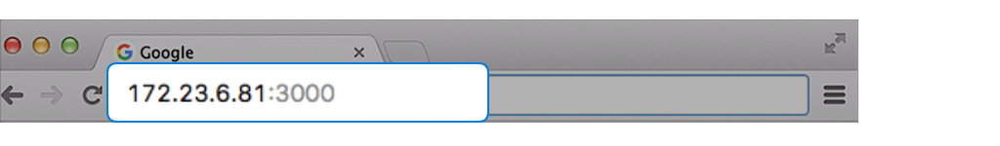

# MCS Lite Application
An on-premises IoT Cloud Platform.

[![Travis][build-badge]][build] [![Github Tag][githubTag-badge]][githubTag] [](https://codecov.io/gh/MCS-Lite/mcs-lite-app) [](https://greenkeeper.io/)

> Note: Common UI and Mobile page are being developed at https://github.com/MCS-Lite/mcs-lite.

## Download Binaries
* You can always get the latest release from [GitHub Releases](https://github.com/MCS-Lite/mcs-lite-app/releases/latest).


## Get Started on Mac or Windows
* Launch **mcs-lite-app** executable file to run MCS Lite platform and access the Admin Console.
	* If you are executing **mcs-lite-app** on MacOS for the first time or if you have changed the file path, be sure to execute the **setup** script to re-initialize config.json file.
   * If you are executing **mcs-lite-app** on MacOS, you may see a warning dialog to stop you launching App which is not downloaded from App Store. Then, please launch MCS Lite from context menu by right-clicking on your mouse.
   
* If MCS Lite is launched for the first time, you have to register an administrator account to sign into the admin console and then start the MCS Lite service.

* Open browser and go to http://mcs_lite_server_IP:3000 for web console to manage your devices. The IP address of MCS Lite server is listed at the Admin Console right after you start the service.


## Get Started on Linux or LinkIt 7688
* You need to have Node.js (>7.3.0) installed on your Linux or LinkIt 7688 first.
* Download and decompress the linux.tar.gz or 7688.tar.gz package. 
* In the application folder, use the following command in your terminal to launch MCS Lite service via Node.js and execute in the background.

	```
	node server.js&
	```
* Once MCS Lite is started, the IP address of MCS  Lite server will be prompted on the terminal console. 

	```
	+-+-+-+ +-+-+-+-+
 	M C S   L I T E 
	+-+-+-+ +-+-+-+-+
	MCS Lite server IP: 
	'10.10.10.10:3000'
	```
	
* Open your browser and connect to the MCS Lite server IP address. Now, you can start to explorer the features of MCS Lite.


## Features
1. **Remote control** your device from MCS Lite console

2. **Collect and visualize data** from your devices.

3. **Manage your devices**.


## Appendix
### MCS Lite Introduction
For more detailed information, please refer to [MCS Lite Introduction](http://mcs-lite-introduction.netlify.com/). 

### Gzip
[Express compression middleware](https://github.com/expressjs/compression#expressconnect) is enabled by default. If you want to disable it, set `GZIP_DISABLE` to `true`.

```
$ NODE_ENV=prod GZIP_DISABLE='true' node server
```


[build-badge]: https://img.shields.io/travis/MCS-Lite/mcs-lite-app/master.svg?style=flat-square
[build]: https://travis-ci.org/MCS-Lite/mcs-lite-app
[githubTag-badge]: https://img.shields.io/github/tag/MCS-Lite/mcs-lite-app.svg?style=flat-square
[githubTag]: https://github.com/MCS-Lite/mcs-lite-app/releases

## What's new

### 1.1.1
* Admin console for administrators to register account, start/stop MCS Lite service and edit configuration.
* Multilingual Support. English, Traditional and Simplified Chinese are available now.
* Bug fixing.

### 1.0.4
* Users registration.
* Prototypes and devices management.
* Upload and retrieve data points.
* Mobile web support.


