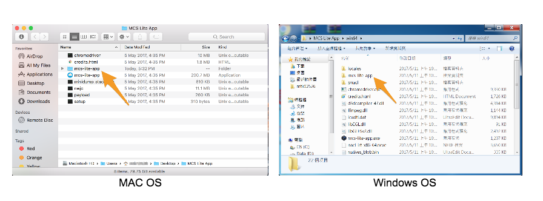
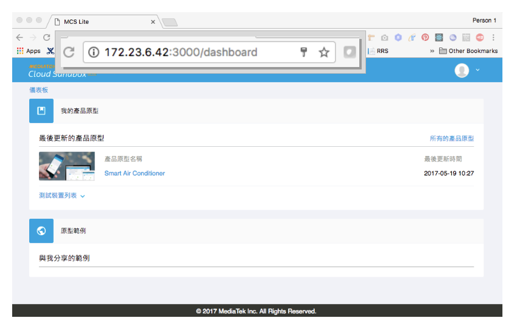

# MCS Lite Application
A on-premises IoT Cloud Platform.

[![Travis][build-badge]][build] [![Github Tag][githubTag-badge]][githubTag] [](https://codecov.io/gh/MCS-Lite/mcs-lite-app) [](https://greenkeeper.io/)

> Note: Common UI and Mobile page are being developed at https://github.com/MCS-Lite/mcs-lite.

## Download Binaries
* You can always get the latest release from [GitHub Releases](https://github.com/MCS-Lite/mcs-lite-app/releases).


## Get Started
* Launch **mcs-lite-app** executable file to run MCS Lite platform and access the Admin Console.

* Open browser and go to http://mcs\_lite\_server\_IP:3000 for web console to manage your devices.


## Features
1. **Remote control** your device from MCS Lite console

2. **Collect and visualize data** from your devices.

3. **Manage your devices**.


## Appendix
### MCS Lite Introduction
For more detailed information, please refer to [MCS Lite Introduction](http://mcs-lite-introduction.netlify.com/). But there is only Traditional Chinese version available at this moment.


### Gzip
[Express compression middleware](https://github.com/expressjs/compression#expressconnect) is enabled by default. If you want to disable it, set `GZIP_DISABLE` to `true`.

```
$ NODE_ENV=prod GZIP_DISABLE='true' node server
```


[build-badge]: https://img.shields.io/travis/MCS-Lite/mcs-lite-app/master.svg?style=flat-square
[build]: https://travis-ci.org/MCS-Lite/mcs-lite-app
[githubTag-badge]: https://img.shields.io/github/tag/MCS-Lite/mcs-lite-app.svg?style=flat-square
[githubTag]: https://github.com/MCS-Lite/mcs-lite-app/releases
